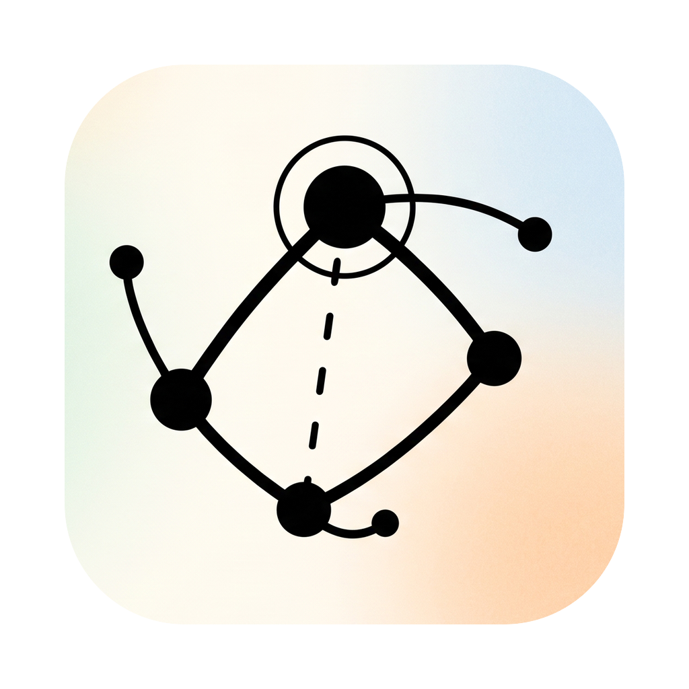
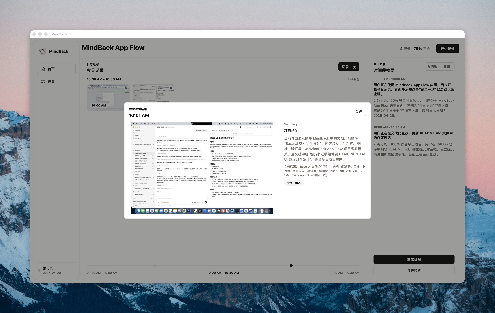
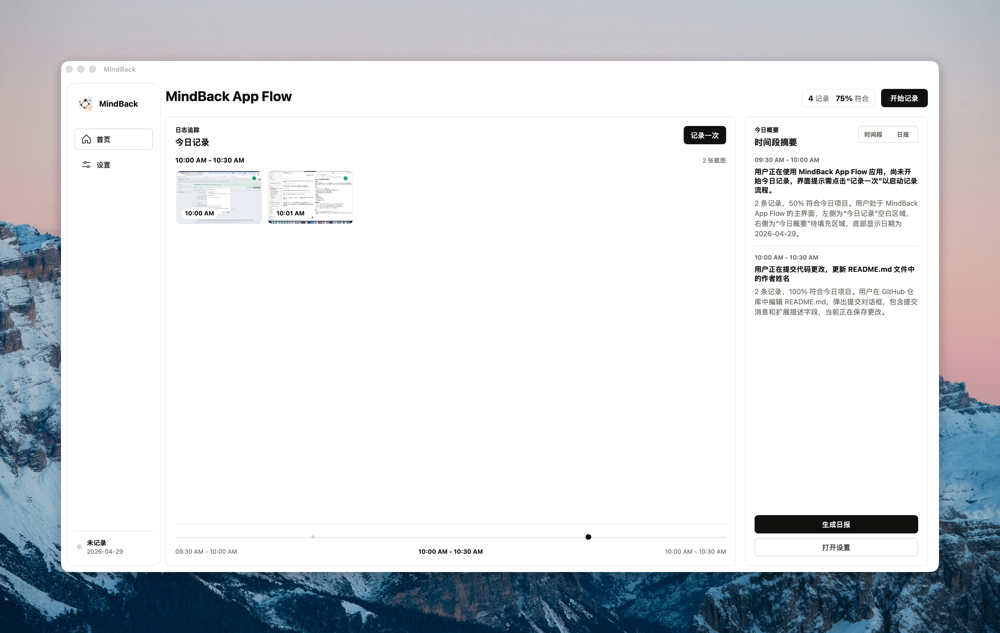

<div align="center">
  
  <h1>MindBack</h1>
  <p>
    
    
    
    
    
    
    
    
  </p>
  <p><strong>本地优先的 macOS 注意力复盘桌面应用。</strong></p>
</div>

MindBack 用于按时间记录当前屏幕上下文，并帮助用户复盘自己是否持续围绕“今日项目”工作。

当前实现基于 Tauri 2、React、Vite、TypeScript、Bun 和 Rust。前端负责配置、记录入口、时间线和摘要展示；Rust 后端负责截图、存储、调度和本地命令；识别与摘要能力通过本地 MLX-VLM worker 和 Bun sidecar 执行。

## 运行截图

### 单次记录识别



### MindBack 主界面




## 功能概览

- 配置今日项目、记录间隔、视觉识别模型和摘要模型。
- 手动记录一次当前屏幕，也可以启动后台自动记录。
- 使用 macOS `screencapture` 生成截图缩略图，并写入本地日志。
- 使用本地 MLX-VLM worker 判断当前行为是否符合今日项目。
- 按半小时生成时间段摘要，并生成当天复盘 Markdown。
- 在缺少模型、Python 依赖或 API Key 时返回结构化错误，并尽量回退到本地摘要。

## 技术栈

- 桌面壳：Tauri 2
- 前端：React 19、Vite、TypeScript、Base UI
- 后端：Rust
- JS 运行时与包管理：Bun
- 本地视觉识别：Python + MLX-VLM
- 摘要 Agent：Vercel AI SDK + DeepSeek provider

## 本地开发

### 前置依赖

- macOS
- Bun
- Rust stable
- Tauri 2 CLI 依赖环境
- 可选：Python 3 与 `mlx-vlm`，用于本地视觉识别

### 安装依赖

```bash
bun install
```

### 配置环境变量

复制示例文件：

```bash
cp .env.example .env
```

常用环境变量：

| 变量 | 用途 |
| --- | --- |
| `DEEPSEEK_API_KEY` | Summary Agent 调用 DeepSeek 时使用；未配置时会回退到本地规则摘要。 |
| `MINDBACK_SUMMARY_MODEL` | Summary Agent 使用的模型名，默认 `deepseek-v4-flash`。 |
| `MINDBACK_MLX_PYTHON` | 覆盖 MLX worker 使用的 Python 路径。 |
| `MINDBACK_MLX_MODEL_PATH` | 覆盖 MLX-VLM 模型路径。 |
| `MINDBACK_WORKER_PATH` | 覆盖 `workers/mlx_worker.py` 路径。 |

默认情况下，后端会优先查找：

```text
~/Library/Application Support/MindBack/venvs/mlx-worker/bin/python
```

模型会优先从配置值、本地路径或以下应用数据目录解析：

```text
~/Library/Application Support/MindBack/models/
```

### 启动桌面应用

```bash
bun run tauri dev
```

如果只需要启动前端预览：

```bash
bun run dev
```

前端预览不会连接完整 Tauri 后端，记录、截图和本地命令能力需要在桌面应用中使用。

## 验证

```bash
bun run build
cargo test --manifest-path src-tauri/Cargo.toml
cargo check --manifest-path src-tauri/Cargo.toml
```

## 本地数据

MindBack 的运行数据默认保存在：

```text
~/Library/Application Support/MindBack
```

其中包括配置、日志、截图缩略图、摘要缓存，以及可选的本地 MLX Python 环境和模型目录。

## 文档

- [实施记录](docs/implementation-notes.md)
- [Attention Supervisor 设计](docs/attention-supervisor-design.md)

## 许可证

本项目使用 MIT License，详见 [LICENSE](LICENSE)。
